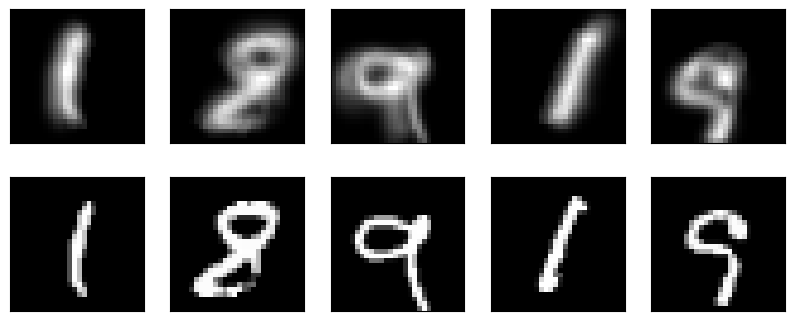

# mnist-image-deblurring

In this project, a convolutional neural network (CNN) has been developed to remove blurring from images of the [MNIST dataset](http://yann.lecun.com/exdb/mnist/). The blurring is simulated by overlapping slightly translated versions of the original images, following a random path.

